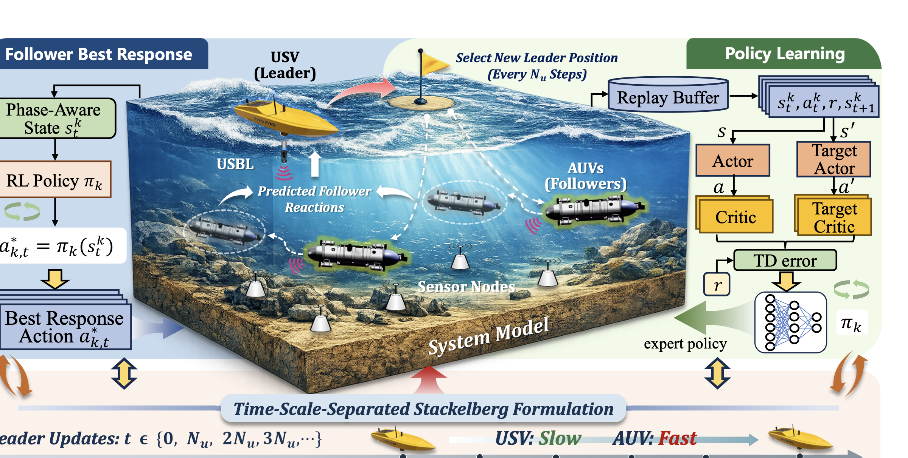

# USV-AUV-delay

Training, evaluation and simulation code for the paper:

> **Communication-Aware Time-Scale-Separated Bi-Level Coordination for USV-AUV Collaboration in Underwater Mobile Computing**
> Jingzehua Xu†, Hongmiaoyi Zhang†

---

## Framework Overview

The figure below shows the system model and the proposed communication-aware time-scale-separated bi-level coordination framework. The USV acts as a slower-timescale leader that optimizes FIM-based sensing geometry using stale leader-side information and predicted follower responses. The AUVs act as faster-timescale followers governed by RL policies with communication-phase-aware states. A control-plane delay-and-packet-loss layer evaluates coordination robustness under realistic acoustic communication uncertainty.

<p align="center"></p>

---

## Experiments

All animations are generated from real experiment data (50 trials × TD3/DSAC-T, acoustic delay + Rayleigh packet loss).

**Trajectory Comparison — Proposed Framework vs Baseline**

*Left: Baseline. Right: Proposed Framework.*

**2 AUVs**
<p align="center"></p>

**3 AUVs**
<p align="center"></p>

**4 AUVs**
<p align="center"></p>

**Real-Time Metrics: Tracking Error / FIM / USV Motion (mean ± std, 50 episodes)**

**2 AUVs**
<p align="center"></p>

**3 AUVs**
<p align="center"></p>

**4 AUVs**
<p align="center"></p>

**RL Backbone Comparison: TD3 vs DSAC-T (Proposed Framework, 3 AUVs)**

<p align="center"></p>

**Advantage Across Team Sizes (2 / 3 / 4 AUVs)**

<p align="center"></p>

**USV Occupancy Heatmap — Proposed Framework vs Baseline**

*Proposed framework keeps the USV focused near the AUV cluster (high-density centre), while the baseline drifts widely across the workspace.*

<p align="center"></p>

**USV Occupancy Metrics (Entropy & Radial Spread)**

<p align="center"></p>

**Mobility–Accuracy Pareto Front & Aggregate Bars**

*Proposed framework simultaneously reduces USV travel distance and AUV tracking error across all team sizes.*

<p align="center"></p>

---

## Requirements

- Python 3.8+
- See `requirements.txt`

## Installation

```bash
git clone https://github.com/Hugh41/USV-AUV-delay.git
cd USV-AUV-delay
pip install -r requirements.txt

# For DSAC-T support
cd DSAC-v2 && pip install -e . && cd ..
```

## Contributing

Contributions are welcome. For documentation fixes, experiment notes, plotting improvements, or code changes, please see [CONTRIBUTING.md](CONTRIBUTING.md) for the recommended workflow and pull request checklist.

## Train

Four training scripts are provided: `train_td3.py`, `train_dsac.py` (single-process), and `train_td3_parallel.py`, `train_dsac_parallel.py` (parallel Ape-X style). Three hardware modes are supported:

| Mode | Script | Hardware |
|:---:|:---|:---|
| CPU | `train_td3.py` / `train_dsac.py` | CPU only |
| Single GPU | `train_td3.py --gpu N` / `train_dsac.py --gpu N` | 1 GPU |
| Parallel | `train_td3_parallel.py --gpu N` / `train_dsac_parallel.py --gpu N` | N CPU + 1 GPU |

### Single-process training

```bash
# TD3 — 2 / 3 / 4 AUVs on GPU 0
python train_td3.py --N_AUV 2 --usv_update_frequency 5 --save_model_freq 5 --gpu 0
python train_td3.py --N_AUV 3 --usv_update_frequency 5 --save_model_freq 5 --gpu 1
python train_td3.py --N_AUV 4 --usv_update_frequency 5 --save_model_freq 5 --gpu 2

# DSAC-T — 2 / 3 / 4 AUVs on GPU 0
python train_dsac.py --N_AUV 2 --usv_update_frequency 5 --save_model_freq 5 --gpu 0
python train_dsac.py --N_AUV 3 --usv_update_frequency 5 --save_model_freq 5 --gpu 1
python train_dsac.py --N_AUV 4 --usv_update_frequency 5 --save_model_freq 5 --gpu 2
```

### Parallel training (faster, Ape-X style)

One GPU learner handles RL training and Stackelberg optimisation.
`--n_workers` CPU processes run environment simulations in parallel and stream
transitions to the learner. No extra GPU is required for workers.

```bash
python train_td3_parallel.py  --N_AUV 2 --usv_update_frequency 5 \
    --save_model_freq 5 --gpu 0 --n_workers 2

python train_dsac_parallel.py --N_AUV 2 --usv_update_frequency 5 \
    --save_model_freq 5 --gpu 0 --n_workers 2
```

### Resume from checkpoint

```bash
# Resume TD3 from episode 395
python train_td3.py --N_AUV 2 --usv_update_frequency 5 --gpu 0 \
    --load_ep 395 --start_episode 396

# Resume parallel DSAC from episode 110
python train_dsac_parallel.py --N_AUV 2 --usv_update_frequency 5 --gpu 0 \
    --load_ep 110 --start_episode 111 --n_workers 2
```

Checkpoints are saved to `models_{algo}_{N_AUV}AUV_{usv_update_frequency}/`
(e.g. `models_td3_2AUV_5/`). Filenames: `TD3_{auv_idx}_{episode}_actor.pth`
for TD3, `DSAC_{auv_idx}_{episode}.pkl` for DSAC-T.

### Key arguments

| Argument | Default | Description |
|:---|:---:|:---|
| `--N_AUV` | 2 | Number of AUVs (2 / 3 / 4) |
| `--usv_update_frequency` | 5 | USV position update interval; must match at evaluation |
| `--episode_num` | 600 | Total training episodes |
| `--episode_length` | 1000 | Steps per episode |
| `--save_model_freq` | 5 | Save checkpoint every N episodes |
| `--gpu` | -1 | GPU device id; -1 = auto (CPU if no CUDA) |
| `--load_ep` | — | Episode number of checkpoint to resume from |
| `--start_episode` | 0 | Episode counter to start at (pair with `--load_ep`) |
| `--n_workers` | 2 | Parallel worker count (`*_parallel.py` only) |
| `--lr` | 0.001 | Learning rate (TD3 only) |
| `--hidden_size` | 128 | Hidden layer width (TD3 only) |
| `--replay_batch_size` | 256 | Mini-batch size (DSAC-T only) |

## Run Experiments

```bash
# Single run: 3 AUVs, TD3, 50 trials
python compare_delay_stackelberg.py --N_AUV 3 --model_type td3 --repeat_num 50
```

Key arguments for `compare_delay_stackelberg.py`:

| Argument | Default | Description |
|---|---|---|
| `--N_AUV` | 2 | Number of AUVs |
| `--model_type` | `td3` | RL backbone: `td3` or `dsac` |
| `--repeat_num` | 50 | Trials per condition |
| `--load_ep` | 575 | Model checkpoint to load |
| `--fixed_delay` | 0.1 s | Fixed propagation delay |
| `--sampling_delay_max` | 0.333 s | Max sampling delay |
| `--packet_loss_modes` | `0,1` | Packet loss modes (0=off, 1=on) |

Results are saved to `delay_comparison_results/`.

## Visualise

```bash
# Animate trained policy in environment
python visualize_env.py --N_AUV 3 --load_ep 500

# Plot comparison results
python visualize_comparison_delay.py
```

Key arguments for `visualize_env.py`:

| Argument | Default | Description |
|---|---|---|
| `--N_AUV` | 2 | Number of AUVs |
| `--load_ep` | — | Model checkpoint to load |
| `--render_length` | 200 | Number of steps to render |
| `--episode_length` | 1000 | Full episode length |
| `--save_gif` | false | Save animation as GIF |

---

## Plot Figures

See [`plot_figures/README.md`](plot_figures/README.md) for the full usage guide.

---

## Citation

```bibtex
@article{xu2026communication,
  title={Communication-Aware Time-Scale-Separated Bi-Level Coordination
         for {USV-AUV} Collaboration in Underwater Mobile Computing},
  author={Xu, Jingzehua and Zhang, Hongmiaoyi},
  year={2026}
}
```

## Acknowledgements

- Baseline: [Never Too Cocky to Cooperate](https://arxiv.org/abs/2504.14894) (Xu et al.)
