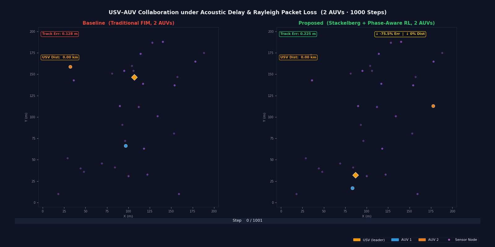
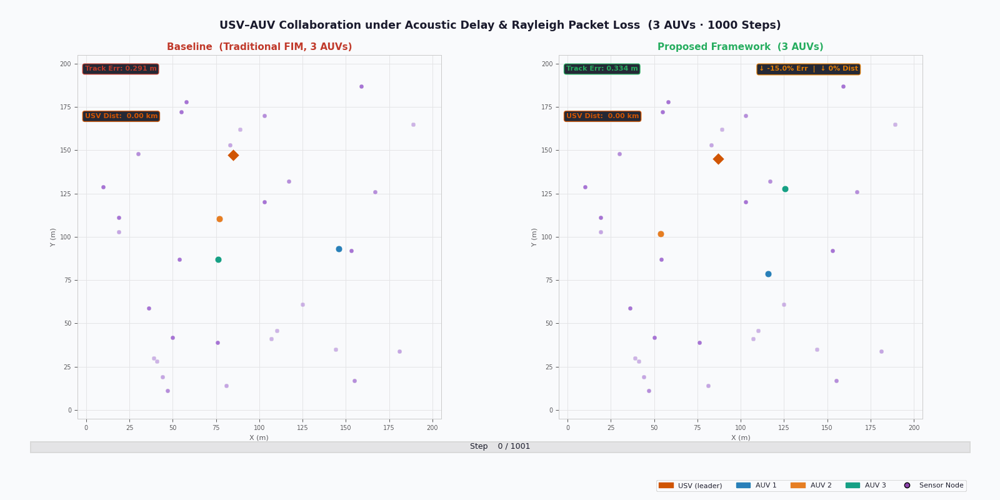
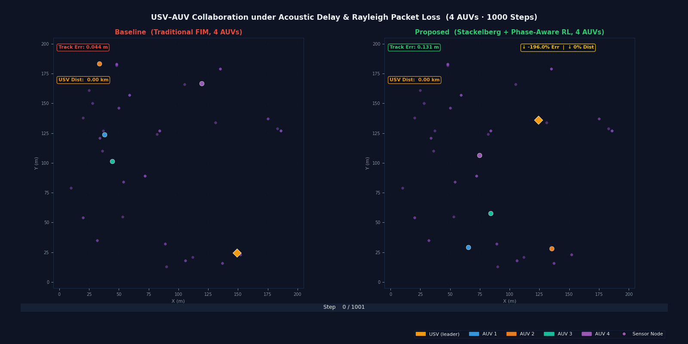
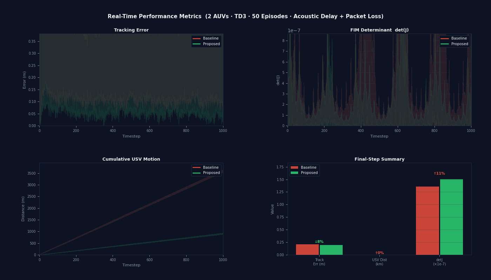
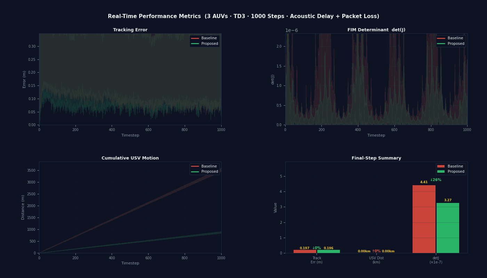
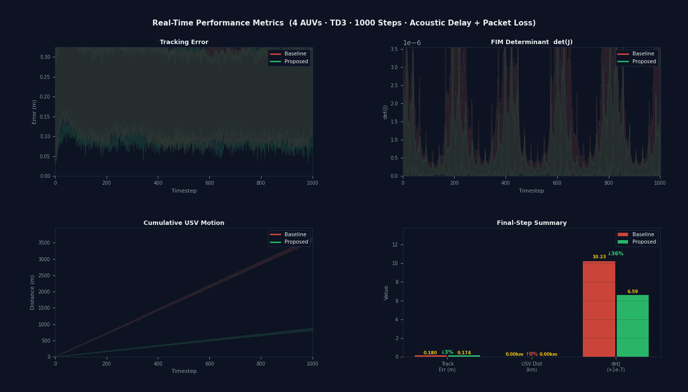
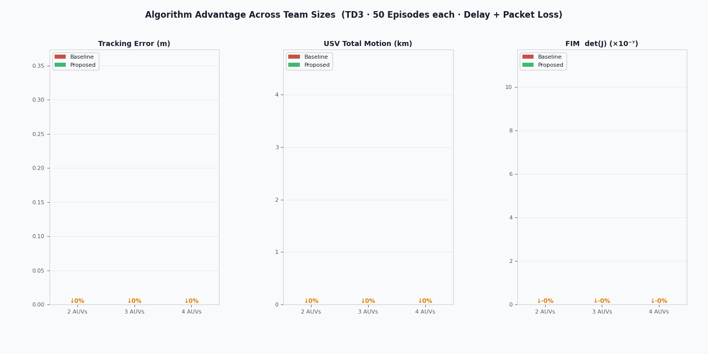
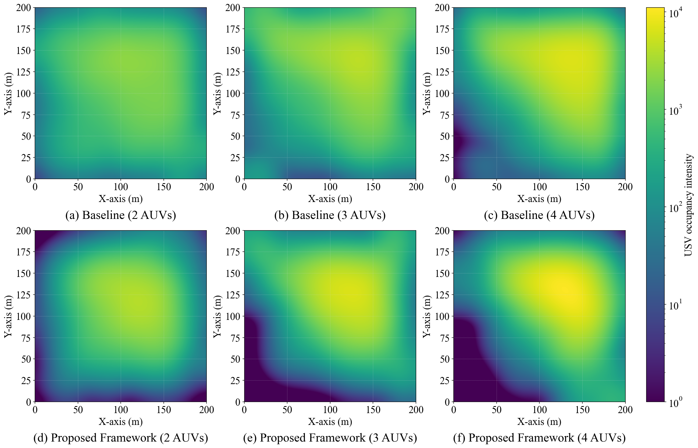
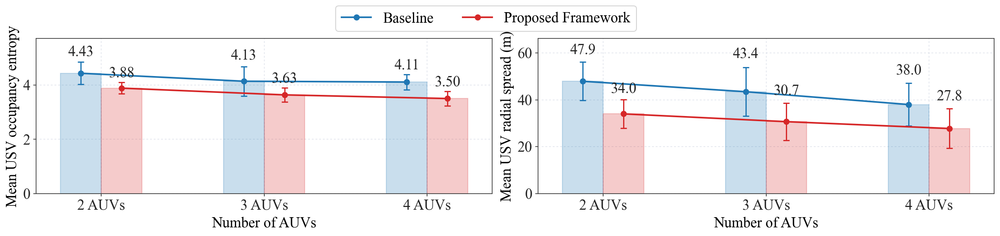
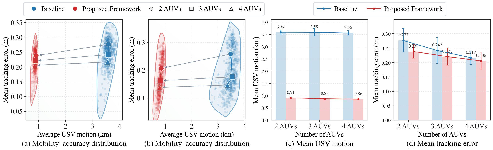

# USV-AUV-delay

Training, evaluation and simulation code for the paper:

> **Communication-Aware Time-Scale-Separated Bi-Level Coordination for USV-AUV Collaboration in Underwater Mobile Computing**
> Jingzehua Xu†, Hongmiaoyi Zhang†, Yubo Huang, Zixi Wang, Junhao Huang, Guanwen Xie, Xiaofan Li
> *IEEE Transactions on Mobile Computing*, 2026.

---

## System Overview

<p align="center"></p>

---

## Demo

All animations are generated from real experiment data (50 trials × TD3/DSAC-T, acoustic delay + Rayleigh packet loss).

**Trajectory Comparison — Stackelberg vs Baseline**

*Left: Baseline. Right: Proposed (Stackelberg + Phase-Aware RL).*

**2 AUVs**
<p align="center"></p>

**3 AUVs**
<p align="center"></p>

**4 AUVs**
<p align="center"></p>

**Real-Time Metrics: Tracking Error / FIM / USV Motion (mean ± std, 50 episodes)**

**2 AUVs**
<p align="center"></p>

**3 AUVs**
<p align="center"></p>

**4 AUVs**
<p align="center"></p>

**RL Backbone Comparison: TD3 vs DSAC-T (Stackelberg, 3 AUVs)**

<p align="center"></p>

**Advantage Across Team Sizes (2 / 3 / 4 AUVs)**

<p align="center"></p>

**USV Occupancy Heatmap — Stackelberg vs Baseline**

*Proposed framework keeps the USV focused near the AUV cluster (high-density centre), while the baseline drifts widely across the workspace.*

<p align="center"></p>

**USV Occupancy Metrics (Entropy & Radial Spread)**

<p align="center"></p>

**Mobility–Accuracy Pareto Front & Aggregate Bars**

*Proposed framework simultaneously reduces USV travel distance and AUV tracking error across all team sizes.*

<p align="center"></p>

---

## Requirements

- Python 3.8+
- See `requirements.txt`

## Installation

```bash
git clone https://github.com/Hugh41/USV-AUV-delay.git
cd USV-AUV-delay
pip install -r requirements.txt

# For DSAC-T support
cd DSAC-v2 && pip install -e . && cd ..
```

## Train

```bash
# TD3 (default)
python train_td3.py --N_AUV 3

# DSAC-T
python train_dsac.py --N_AUV 3
```

Key arguments for `train_td3.py` / `train_dsac.py`:

| Argument | Default | Description |
|---|---|---|
| `--N_AUV` | 2 | Number of AUVs |
| `--episode_num` | 600 | Training episodes |
| `--episode_length` | 1000 | Steps per episode |
| `--n_s` | 30 | Number of sensor nodes |
| `--N_u` / `--usv_update_frequency` | 5 | USV update interval (must match at eval) |
| `--lr` | 0.001 | Learning rate (TD3) |
| `--hidden_size` | 128 | Hidden layer size (TD3) |
| `--save_model_freq` | 25 | Save checkpoint every N episodes |
| `--load_ep` | — | Resume training from checkpoint |

Models are saved to `models_{type}_{N_AUV}AUV_{Nu}/`.

## Run Experiments

```bash
# Single run: 3 AUVs, TD3, 50 trials
python compare_delay_stackelberg.py --N_AUV 3 --model_type td3 --repeat_num 50
```

Key arguments for `compare_delay_stackelberg.py`:

| Argument | Default | Description |
|---|---|---|
| `--N_AUV` | 2 | Number of AUVs |
| `--model_type` | `td3` | RL backbone: `td3` or `dsac` |
| `--repeat_num` | 50 | Trials per condition |
| `--load_ep` | 575 | Model checkpoint to load |
| `--fixed_delay` | 0.1 s | Fixed propagation delay |
| `--sampling_delay_max` | 0.333 s | Max sampling delay |
| `--packet_loss_modes` | `0,1` | Packet loss modes (0=off, 1=on) |

Results are saved to `delay_comparison_results/`.

## Visualise

```bash
# Animate trained policy in environment
python visualize_env.py --N_AUV 3 --load_ep 500

# Plot comparison results
python visualize_comparison_delay.py
```

Key arguments for `visualize_env.py`:

| Argument | Default | Description |
|---|---|---|
| `--N_AUV` | 2 | Number of AUVs |
| `--load_ep` | — | Model checkpoint to load |
| `--render_length` | 200 | Number of steps to render |
| `--episode_length` | 1000 | Full episode length |
| `--save_gif` | false | Save animation as GIF |

---

## Citation

```bibtex
@article{xu2026communication,
  title={Communication-Aware Time-Scale-Separated Bi-Level Coordination
         for {USV-AUV} Collaboration in Underwater Mobile Computing},
  author={Xu, Jingzehua and Zhang, Hongmiaoyi and Huang, Yubo and
          Wang, Zixi and Huang, Junhao and Xie, Guanwen and Li, Xiaofan},
  journal={IEEE Transactions on Mobile Computing},
  year={2026},
  publisher={IEEE}
}
```

## Acknowledgements

- DSAC-T: [DSAC-v2](https://github.com/Jingliang-Duan/DSAC-v2) (Duan et al., TPAMI 2025)
- Baseline: [Never Too Cocky to Cooperate](https://arxiv.org/abs/2504.14894) (Xu et al., IEEE TMC 2026)
