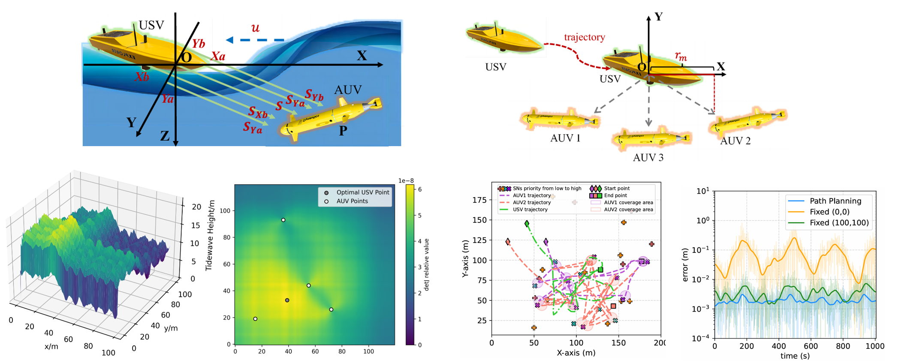

# USV-AUV-delay

[](https://ieeexplore.ieee.org/xpl/RecentIssue.jsp?punumber=7755)
[](https://www.python.org/downloads/)
[](LICENSE)

Official simulation code for the paper:

> **Communication-Aware Time-Scale-Separated Bi-Level Coordination for USV-AUV Collaboration in Underwater Mobile Computing**
> Jingzehua Xu†, Hongmiaoyi Zhang†, Yubo Huang, Zixi Wang, Junhao Huang, Guanwen Xie, Xiaofan Li
> *IEEE Transactions on Mobile Computing*, 2026. ([IROS 2025 preliminary version](https://ieeexplore.ieee.org/))

---

## Demo

### Trajectory Comparison: Stackelberg vs Baseline

> *Left: Baseline (traditional FIM, updates every step).  
> Right: **Proposed** (Stackelberg + Phase-Aware RL, updates every $N_u = 5$ steps).*

<p align="center">
  
</p>

**Key visual observation:** The proposed framework keeps the USV within a compact operating corridor
(amber diamond) while AUVs maintain broad coverage of sensor nodes.
The baseline USV wanders across the workspace, racking up ~4× more surface motion.

---

### Real-Time Metrics: Tracking Error / FIM Stability / USV Motion

<p align="center">
  
</p>

| Metric | Baseline | **Proposed** | Improvement |
|--------|:--------:|:------------:|:-----------:|
| Avg. Tracking Error (2 AUV) | 0.277 m | **0.239 m** | **−13.8%** |
| Avg. Tracking Error (3 AUV) | 0.242 m | **0.221 m** | **−8.7%** |
| Avg. Tracking Error (4 AUV) | 0.217 m | **0.206 m** | **−5.3%** |
| USV Cumulative Motion       | ~3.6 km | **~0.9 km** | **−75%** |
| FIM Stability               | spiky   | **smooth**  | ✓ |

---

## Overview

This repository implements a **communication-aware, time-scale-separated bi-level coordination framework** for USV–AUV collaboration that explicitly accounts for:

- **Long acoustic propagation delay** (modelled as $\tau = \tau_\text{samp} + \tau_\text{proc} + d/c_a$)
- **Rayleigh-fading packet loss** (distance-dependent PER via SNR → BER → PER chain)
- **Stale leader-side observations** (buffered, delay-fused AUV position estimates)

The framework exploits the **intrinsic time-scale asymmetry** between the surface leader and underwater followers:

```
Upper layer (USV / Leader)                 Lower layer (AUV / Followers)
──────────────────────────────────         ──────────────────────────────────
Updates every Nu = 5 steps                 Acts every step
Optimises FIM det(J) via DE               TD3 / DSAC-T policy
Uses stale + buffered AUV positions       Phase-aware state φ_t = (t mod Nu)/Nu
Predicts follower best-response           Adapts to temporal coordination phase
```

<p align="center">
  
</p>

---

## Repository Structure

```
USV-AUV-delay/
├── env.py                          # Simulation environment
├── td3.py                          # TD3 actor-critic
├── tidewave_usbl.py                # USBL acoustic positioning model
├── stackelberg_game.py             # USV Stackelberg leader (FIM + DE)
├── water_model.py                  # Acoustic delay & packet-loss model
├── colab.py                        # Collaboration utilities
│
├── train_td3.py                    # Train AUV followers (TD3)
├── train_dsac.py                   # Train AUV followers (DSAC-T)
├── eval_td3.py                     # Evaluate trained TD3 policies
│
├── compare_delay_stackelberg.py    # Run Table II/III experiments
├── compare_stackelberg.py          # Run comparison without delay
├── run_delay_packetloss_exp.sh     # Batch run all team-size settings
│
├── visualize_env.py                # Animate environment (trained model)
├── visualize_comparison.py         # Visualise comparison results
├── visualize_comparison_delay.py   # Visualise delay-condition results
│
├── create_demo_gif.py              # ★ Generate trajectory comparison GIF
├── create_metrics_gif.py           # ★ Generate real-time metrics GIF
│
├── figures/                        # Paper figure reproduction (Fig. 1–9)
│   ├── plot_episode_frontier_delay.py
│   ├── plot_td3_auv_panels.py
│   ├── plot_td3_usv_occupancy_heatmaps.py
│   ├── plot_phasewise_tracking_advantage.py
│   └── plot_delay_compensation_phase_map.py
│
├── docs/                           # Generated GIF outputs (for README)
├── DSAC-v2/                        # DSAC-T backbone (submodule)
└── requirements.txt
```

---

## Quick Start

### Installation

```bash
git clone https://github.com/<your-username>/USV-AUV-delay.git
cd USV-AUV-delay
pip install -r requirements.txt

# For DSAC-T support
cd DSAC-v2 && pip install -e . && cd ..
```

### 1 — Train AUV Policies

```bash
# TD3 (default backbone)
python train_td3.py --N_AUV 3

# DSAC-T (for generalisation study)
python train_dsac.py --N_AUV 3
```

Models are saved to `models_td3_3AUV_5/` (format: `models_{type}_{N_AUV}AUV_{Nu}/`).

### 2 — Run Experiments (Tables II & III)

```bash
# Single run: 3 AUVs, TD3, with acoustic delay + packet loss
python compare_delay_stackelberg.py --N_AUV 3 --rl_type td3 --repeat_num 50

# Batch: all team sizes (2/3/4 AUVs) × both RL backbones
bash run_delay_packetloss_exp.sh
```

Results are saved to `delay_comparison_results/`.

### 3 — Generate Demo GIFs

```bash
# Trajectory comparison GIF (Stackelberg vs Baseline side-by-side)
python create_demo_gif.py --n_auv 3 --duration 10

# Real-time metrics GIF (tracking error, FIM, USV motion)
python create_metrics_gif.py --n_auv 3 --duration 12
```

GIFs are written to `docs/`.

### 4 — Reproduce Paper Figures (Fig. 1–9)

```bash
python figures/plot_episode_frontier_delay.py       # Fig. 1
python figures/plot_td3_auv_panels.py               # Fig. 2-4
python figures/plot_td3_usv_occupancy_heatmaps.py   # Fig. 5-6
python figures/plot_phasewise_tracking_advantage.py # Fig. 7
python figures/plot_delay_compensation_phase_map.py # Fig. 8-9
```

### 5 — Visualise Live Environment

```bash
python visualize_env.py --N_AUV 3 --load_ep 500
```

---

## Method

### Problem

Most USV-AUV coordination frameworks assume *synchronous* state access. In realistic underwater systems, acoustic communication introduces:

| Challenge | Consequence |
|-----------|-------------|
| Long propagation delay $\tau \propto d/c_a$ | USV makes decisions on stale follower positions |
| Rayleigh-fading packet loss | AUV positions intermittently unavailable |
| Asynchronous updates | Followers must act without fresh leader commands |

### Solution

**Communication-aware time-scale-separated bi-level coordination:**

**Upper layer (USV leader)** — updated every $N_u = 5$ steps:

$$p^*_{u,t} = \arg\max_{p_u \in \mathcal{Q}_t} \det J\!\left(p_u,\; \hat{P}^{\text{br}}_{a,t+1}(p_u;\, \bar{P}_{a,t})\right)$$

*Uses stale buffered AUV estimates $\bar{P}_{a,t}$ and predicts follower best-responses before selecting the FIM-optimal geometry.*

**Lower layer (AUV followers)** — acts every step:

$$s^k_t = \left\{\Delta p^k_{j,t},\; \Delta p^k_{\text{tar},t},\; \tilde{p}_{k,t},\; b_{k,t},\; \rho_{\text{overflow},t},\; \underbrace{\phi_t = \tfrac{t \bmod N_u}{N_u}}_{\text{communication phase}}\right\}^\top$$

*The phase term $\phi_t$ removes scheduler aliasing: same geometry at different phases implies different next-step dynamics.*

### Theoretical Guarantees

| Result | Claim |
|--------|-------|
| Lemma V.1 | $\mathbb{E}[\tau \mid d] = 0.2665 + d/1500$ — delay grows affinely with distance |
| Prop. V.2 | Buffered error resets on reception; packet loss is the accumulation driver |
| Prop. V.3 | Phase term $\phi_t$ is *necessary* — its omission causes scheduler aliasing |
| Theorem V.4 | Stage-wise Stackelberg equilibrium *exists* (Weierstrass theorem) |
| Theorem V.5 | Prediction-mismatch loss $\leq 2L_J\varepsilon_{\text{br}} + \eta_t$ |
| Prop. V.6 | Average USV motion $\leq \Delta_u/N_u + \Delta_u/H$ (structural bound) |

---

## Experimental Configuration

| Parameter | Value |
|-----------|-------|
| Workspace | 200 m × 200 m, depth 100 m |
| Sensor nodes | 30, Poisson rate ∈ {3,5,8,12} Mbps |
| AUV team size | 2 / 3 / 4 |
| AUV speed | [1.2, 2.2] m/s |
| USV update interval $N_u$ | 5 steps |
| Episode length | 1000 steps |
| Acoustic frequency | 20 kHz |
| Packet size $L_p$ | 4096 bits |
| Fading | Rayleigh, $\sigma_h = 1/\sqrt{2}$ |
| DE solver | $P=20$, $I=100$ |
| Evaluation | 50 trials × 3 groups |

---

## Citation

```bibtex
@article{xu2026communication,
  title={Communication-Aware Time-Scale-Separated Bi-Level Coordination
         for {USV-AUV} Collaboration in Underwater Mobile Computing},
  author={Xu, Jingzehua and Zhang, Hongmiaoyi and Huang, Yubo and
          Wang, Zixi and Huang, Junhao and Xie, Guanwen and Li, Xiaofan},
  journal={IEEE Transactions on Mobile Computing},
  year={2026},
  publisher={IEEE}
}
```

---

## License

MIT License. See [LICENSE](LICENSE) for details.  
The DSAC-v2 submodule has its own license — see `DSAC-v2/README.md`.

---

## Acknowledgements

- DSAC-T: [DSAC-v2](https://github.com/Jingliang-Duan/DSAC-v2) (Duan et al., TPAMI 2025)
- Baseline: *"Never Too Cocky to Cooperate"* (Xu et al., IEEE TMC 2026)
